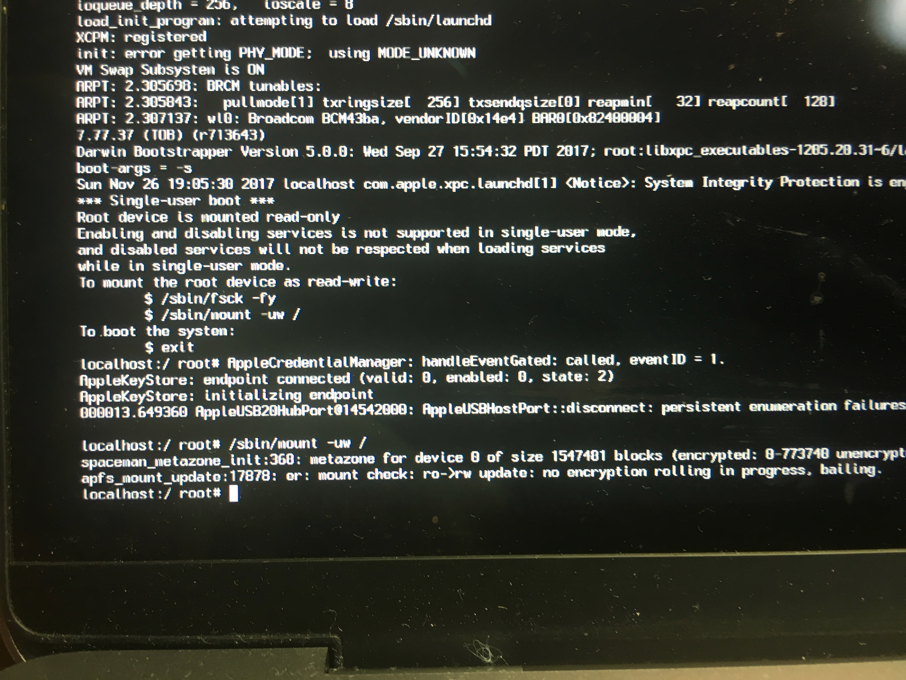
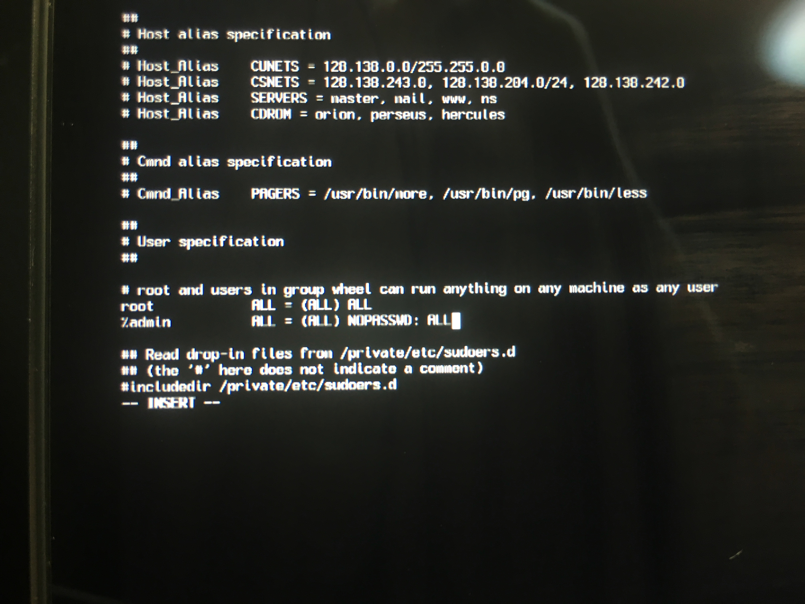
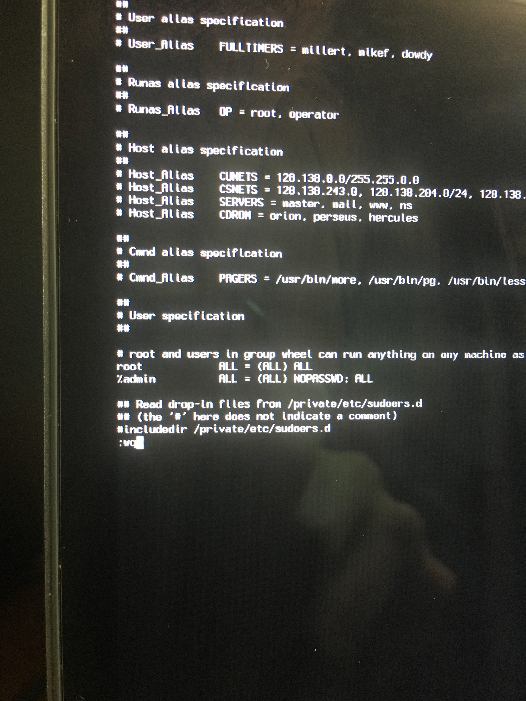
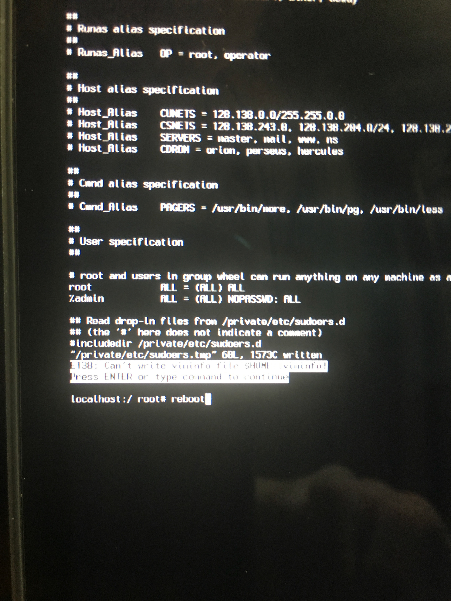
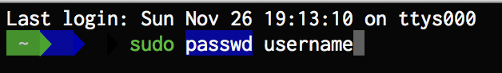

* `Command + S`を押しながらMacを起動
* 読み込みが終わったら，以下のコマンドを実行.  
   ```/sbin/mount -uw /```  
   

* 次に以下のコマンドを実行．  
   ```visudo```

* テキストの編集画面が表示されるので，`i`キーを入力
* 左下が`-- INSERT --`になるのを確認したら，↓キーで  
	```%admin	ALL = (ALL) ALL```
  の行までカーソルを移動し，以下のように変更  
   ```%admin ALL = (ALL) NOPASSWD: ALL```
   
	(ただし，`:`は`Shift + ;`で入力する)
* 編集が完了したら`Ctrl + C`を押して，最後に`:wq`と入力(先と同様，`:`は`Shift + ;`で入力する)
	
* 以下のようなエラーが表示されるかもしれないが，無視して`Return`キーを押し，`reboot`コマンドを入力して再起動
	
* 自動ログインでMacにログインしたらターミナルを起動し，`sudo passwd (ユーザー名)`を実行
     
   あとは新規パスワードを入力し，確認としてもう一度同じパスワードを入力して完了
